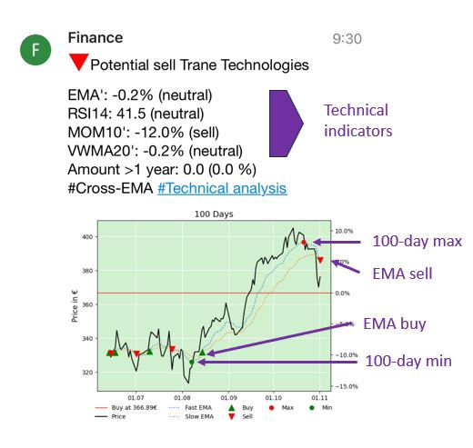

# Crypto and Stock Alert - CaSa 

## Overview

This project provides a Python-based system for analyzing and monitoring cryptocurrencies and stocks. It uses indicators like Moving Averages, RSI, and EMA to evaluate trends and alert users on significant market conditions. The system can track and visualize data, calculate profits, and send notifications using Pushover.

## Features

- **Automatic Data Retrieval**: Fetches crypto data from CoinGecko and stock data from Yahoo Finance.
- **Indicator Calculations**: Calculates indicators such as Fast EMA, Slow EMA, RSI, and VWMA for analysis.
- **Alarms**: Sends buy/sell signals based on custom thresholds and market trends.
- **Scheduling**: Configurable scheduling for running hourly and daily analyses.
- **Portfolio-list**: Tracks trends and potential buy and sell signals based on configured indicators.
- **Watch-List**: Tracks trends and potential buy signals based on configured indicators.

## Project Structure

- `classes.py`: Contains the `crypto_stock` class, which manages individual crypto or stock entities, stores transaction data, and processes alarms.
- `func.py`: Utility functions for data retrieval, indicator calculations, alarm handling, and image generation.
- `main.py`: The main script that orchestrates the data analysis process, schedules tasks, and manages notifications.
- `config.ini`: Contains a crypto and stock list, alert limits, and the API key. This file is not included in the GitHub structure and must be created manually with the configuration details below.

## Installation

1. Install Python 3.
2. Install Dependencies: `pip3 install pandas numpy yfinance scipy matplotlib plotly schedule requests pytrends configparser http.client urllib3`
3. Create `config.ini` in the root directory (see **Configuration File** section).
4. Run the script: `python main.py`

**Note**: This project is tested on a RockPi3 with Armbian OS, initiated over SSH and using a mapped folder for editing the `config.ini`.

## Get a Pushover Message

- **Status message**: Provides information about the program start or errors.
- **Potential buy/sell alert**: Alerts for review based on indicators; decision-making is up to the user.
  - **Price**: 7-day price slope for context.
  - **EMA**: Slope of the Exponential Moving Average indicator.
  - **RSI14**: 14-day Relative Strength Index, indicating if an asset is overbought or oversold.
  - **MOM10**: 10-day Momentum indicator slope, reflecting price change speed.
  - **VWMA20**: 20-day Volume Weighted Moving Average slope, adjusting price trends by trading volume.
  - **Amount >1 year**: Asset quantity held for over a year, relevant for tax free crypto transactions (like in Germany, Portugal, Belgium and Luxembourg).
  - **# [Alert type]**: Specifies alert type, like “#Cross-EMA” for an EMA crossover or “#100-Minimum” for a 100-day low.
  - **# Technical analysis**: Provides additional references or links for deeper insights.
- **Daily summary**: Summary of all crypto and stock items, sorted by rating (indicator count suggesting a buy).



## Configuration File (config.ini)

The `config.ini` file should contain sections like `pushover`, `alarm`, `crypto`, and `stocks`. Here’s an example configuration:

```ini
[pushover]
token = YOUR_PUSHOVER_TOKEN
user = YOUR_PUSHOVER_USER_KEY

[alarm]
one_day_price_change = 10       # Threshold for a one-day price change alarm (%).
seven_day_price_change = 7      # Threshold for a seven-day price change alarm (%).
previous_alarm_change = 3       # Minimum change required between consecutive alarms (%).
one_day_profit_limit = -2       # Profitability threshold for a one-day period (%). #currently inactive
test_mode = 0                   # Test mode

[crypto]
bitcoin = Bitcoin; 1000,0.05,01/01/2022; 1000,0.05,2/01/2022   # Standard Mode: API ID (https://www.coingecko.com/); Display name; Investment in €, Quantity; Buy date in DD/MM/YYYY
matic-network = Polygon; 1 , 1, 1                              # Watch list mode

[stocks]
APC.DE = Apple; 1000,10,01/01/2022       # Standard Mode: EURO-Symbol (https://finance.yahoo.com/); Display name; Investment in €, Quantity, Buy date in DD/MM/YYYY
LHA.DE = Lufthansa; 1, 1, 1            # Watch list mode
```

**Note**: Use only stock symbols with the Euro currently (e.g. APC.DE and AMZ.DE).

## Dependencies

- **Python Libraries**: `pandas`, `numpy`, `yfinance`, `scipy`, `matplotlib`, `plotly`, `schedule`, `requests`, `pytrends`, `configparser`, `http.client`, `urllib3`
- **External APIs**: Requires access to Pushover (free account needed), CoinGecko, and Yahoo Finance APIs.

## License

This project is licensed under the MIT License.
